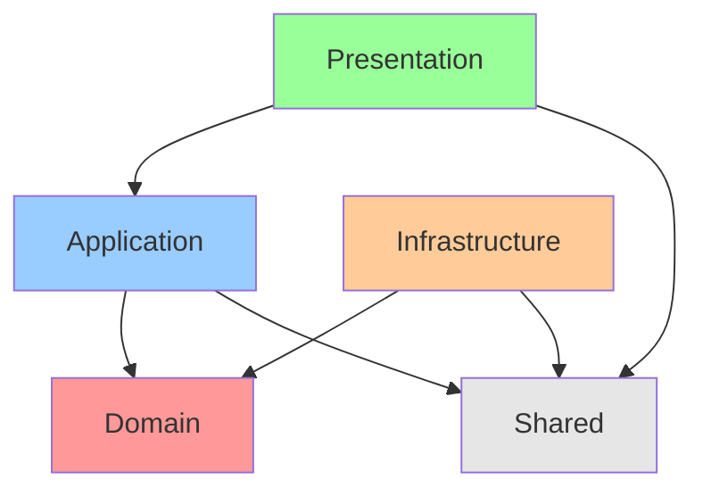
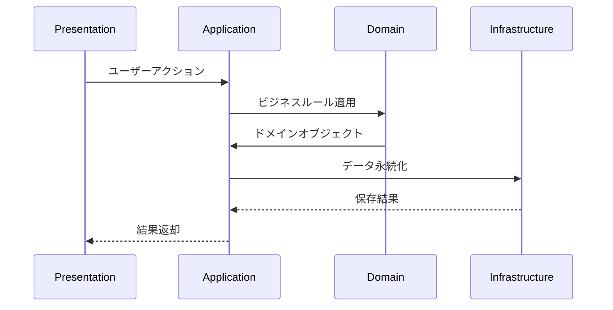

# アーキテクチャ設計書

## 概要

このドキュメントでは、accustomedプロジェクトにおけるレイヤードアーキテクチャの設計について説明します。クリーンアーキテクチャの原則に基づき、責務を明確に分離し、保守性と拡張性を向上させることを目的としています。

## レイヤー構造

```txt
src/
├── presentation/           # プレゼンテーション層（UI層）
│   ├── components/         # Reactコンポーネント
│   ├── hooks/             # UIロジック用フック
│   └── pages/             # ページコンポーネント（App Router対応）
│
├── application/           # アプリケーション層（ユースケース層）
│   ├── usecases/          # ユースケース実装
│   │   ├── task/          # タスク関連ユースケース
│   │   │   ├── CreateTaskUseCase.ts
│   │   │   ├── UpdateTaskUseCase.ts
│   │   │   ├── DeleteTaskUseCase.ts
│   │   │   ├── ToggleTaskUseCase.ts
│   │   │   └── GetTaskStatsUseCase.ts
│   │   └── history/       # 履歴関連ユースケース
│   │       ├── GetMonthlyHistoryUseCase.ts
│   │       └── GetWeeklyProgressUseCase.ts
│   └── services/          # アプリケーションサービス
│       ├── TaskService.ts
│       └── HistoryService.ts
│
├── domain/                # ドメイン層
│   ├── entities/          # エンティティ
│   │   ├── Task.ts
│   │   ├── TaskConfiguration.ts
│   │   ├── TaskInstance.ts
│   │   └── TaskStats.ts
│   ├── valueObjects/      # 値オブジェクト
│   │   ├── TaskFrequency.ts
│   │   ├── TaskDuration.ts
│   │   └── TaskStatus.ts
│   ├── repositories/      # リポジトリインターフェース
│   │   └── TaskRepository.ts
│   └── services/          # ドメインサービス
│       ├── TaskDomainService.ts
│       └── DateService.ts
│
├── infrastructure/        # インフラストラクチャ層
│   ├── repositories/      # リポジトリ実装
│   │   └── LocalStorageTaskRepository.ts
│   ├── storage/          # ストレージ関連
│   │   └── localStorage.ts
│   └── utils/            # インフラ用ユーティリティ
│       └── dateUtils.ts
│
└── shared/               # 共有層
    ├── types/            # 共有型定義
    │   └── index.ts
    ├── constants/        # 定数
    │   └── taskConstants.ts
    └── utils/            # 共有ユーティリティ
        └── utils.ts
```

## 各層の責務

### 1. Domain層（ドメイン層）

**責務**: ビジネスルールとドメインロジックの実装

- **エンティティ**: Task, TaskConfiguration, TaskInstance等のビジネスオブジェクト
- **値オブジェクト**: TaskFrequency, TaskDuration等の値表現
- **ドメインサービス**: 複数エンティティにまたがるビジネスロジック
- **リポジトリインターフェース**: データアクセスの抽象化

### 2. Application層（ユースケース層）

**責務**: ビジネスプロセスの組み合わせとフロー制御

- **ユースケース**: 具体的なビジネス機能（タスク作成、更新、削除等）
- **アプリケーションサービス**: 複数ユースケースの調整

### 3. Presentation層（プレゼンテーション層）

**責務**: UIとユーザーインタラクション

- **コンポーネント**: Reactコンポーネント
- **フック**: UI状態管理とユースケース呼び出し

### 4. Infrastructure層（インフラストラクチャ層）

**責務**: 外部システムとの連携（DB、API、ローカルストレージ等）

- **リポジトリ実装**: ドメインリポジトリの具体実装
- **ストレージ**: データ永続化の実装

### 5. Shared層（共有層）

**責務**: 技術的な共通要素のみを提供（ビジネスロジックは含まない）

- **型定義**: TypeScript型（プリミティブ型のエイリアス、共通インターフェース等）
- **定数**: 技術的定数（設定値、列挙値等）
- **ユーティリティ**: 純粋関数のみ（日付操作、文字列処理等）

**重要**: Shared層にはドメイン固有のロジックやビジネスルールを含めてはいけない

## 依存関係

### 基本原則

- **内側の層は外側の層に依存しない**
- **外側の層は内側の層に依存できる**
- **依存関係の逆転**: インターフェースを使用してDomain層がInfrastructure層に依存しないようにする

### 依存関係図



### レイヤー間のデータフロー



## 期待される効果

- **保守性の向上**: 責務が明確に分離されることで、変更の影響範囲が限定される
- **拡張性の向上**: 新機能の追加が既存コードに与える影響を最小化
- **テスト容易性**: 各層を独立してテストできる
- **再利用性**: ドメインロジックが他の層に依存しないため、再利用しやすい

## 注意点

- 過度な抽象化を避け、現在の要件に適したレベルでの実装を心がける
- TypeScriptの型システムを活用して、コンパイル時に依存関係の違反を検出できるようにする
- 各層の境界を明確にし、適切なインターフェースを通じてのみ通信する

### Shared層の設計原則

**含めるべきもの**:

- プリミティブ型のエイリアス（`type UserId = string`等）
- 技術的な設定定数（`MAX_RETRY_COUNT = 3`等）  
- 純粋関数のユーティリティ（`formatDate()`, `isValidEmail()`等）
- 共通のTypeScript型定義（APIレスポンス型等）

**含めるべきでないもの**:

- ドメイン固有のビジネスルール
- 特定の層でのみ使用されるロジック
- 状態を持つオブジェクトやクラス
- 特定のユースケースに依存する処理

**判断基準**: 「この要素はビジネスドメインに関係なく、技術的な共通処理として他のプロジェクトでも使えるか？」
