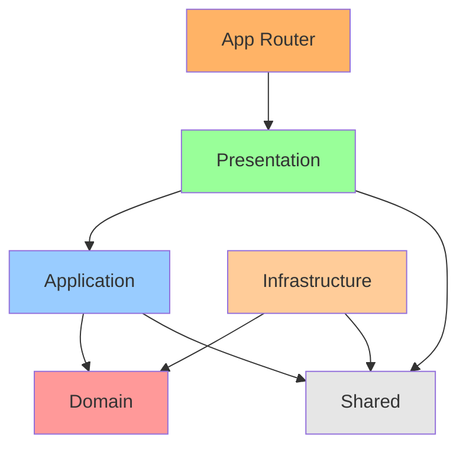
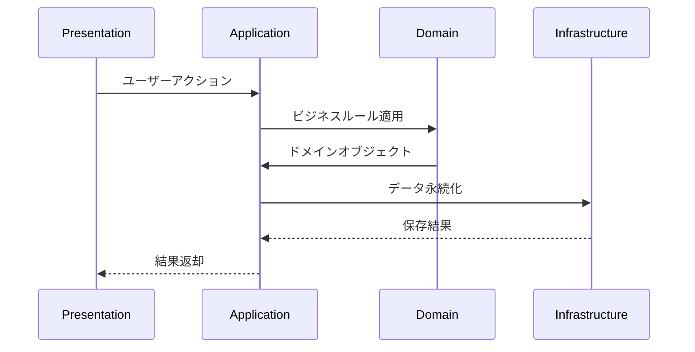

# アーキテクチャ設計書

## 概要

このドキュメントでは、accustomed プロジェクトにおけるレイヤードアーキテクチャの設計について説明します。クリーンアーキテクチャの原則に基づき、責務を明確に分離し、保守性と拡張性を向上させることを目的としています。

## レイヤー構造

```txt
src/
├── app/                   # Next.js App Router
│   ├── page.tsx           # メインページ
│   ├── layout.tsx         # ルートレイアウト
│   └── globals.css        # グローバルスタイル
│
├── presentation/          # プレゼンテーション層（UI層）
│   ├── components/        # Reactコンポーネント
│   │   ├── task-list.tsx
│   │   ├── task-card.tsx
│   │   ├── add-task-modal.tsx
│   │   ├── weekly-progress.tsx
│   │   ├── monthly-history.tsx
│   │   ├── date-grid.tsx
│   │   └── dashboard.tsx
│   ├── hooks/            # UIロジック用フック
│   │   ├── useTasks.ts
│   │   └── use-toast.ts
│   ├── ui/               # shadcn/uiコンポーネント
│   │   ├── button.tsx
│   │   ├── card.tsx
│   │   ├── dialog.tsx
│   │   ├── input.tsx
│   │   ├── select.tsx
│   │   └── ... (その他のUIコンポーネント)
│   └── pages/            # ページコンポーネント（予備）
│
├── application/          # アプリケーション層（ユースケース層）
│   └── task-application-service.ts  # タスク関連アプリケーションサービス
│
├── domain/               # ドメイン層
│   ├── task.ts           # タスクエンティティ
│   ├── task-domain-service.ts      # タスクドメインサービス
│   ├── date-domain-service.ts      # 日付ドメインサービス
│   └── task-repository.ts          # タスクリポジトリインターフェース
│
├── infrastructure/       # インフラストラクチャ層
│   ├── local-storage.ts              # ローカルストレージ実装
│   └── local-storage-task-repository.ts  # タスクリポジトリ実装
│
└── shared/              # 共有層
    ├── common-types.ts   # 共有型定義
    ├── date-utils.ts     # 日付ユーティリティ
    └── utils.ts          # 汎用ユーティリティ
```

## 各層の責務

### 1. Domain 層（ドメイン層）

**責務**: ビジネスルールとドメインロジックの実装

- **エンティティ**: `Task` - タスクのビジネスオブジェクト
- **ドメインサービス**:
  - `TaskDomainService` - タスク関連のビジネスロジック
  - `DateDomainService` - 日付関連のビジネスロジック
- **リポジトリインターフェース**: `TaskRepository` - データアクセスの抽象化

### 2. Application 層（ユースケース層）

**責務**: ビジネスプロセスの組み合わせとフロー制御

- **アプリケーションサービス**: `TaskApplicationService` - タスク関連のユースケース統合

### 3. Presentation 層（プレゼンテーション層）

**責務**: UI とユーザーインタラクション

- **コンポーネント**:
  - フィーチャーコンポーネント（`TaskList`, `TaskCard`, `AddTaskModal`等）
  - 進捗表示コンポーネント（`WeeklyProgress`, `MonthlyHistory`, `DateGrid`）
- **フック**:
  - `useTasks` - タスクデータの状態管理
  - `useToast` - 通知メッセージの管理
- **UI コンポーネント**: shadcn/ui ベースの再利用可能な UI エレメント

### 4. Infrastructure 層（インフラストラクチャ層）

**責務**: 外部システムとの連携（ローカルストレージ等）

- **リポジトリ実装**: `LocalStorageTaskRepository` - タスクリポジトリのローカルストレージ実装
- **ストレージ**: `LocalStorage` - ローカルストレージの抽象化

### 5. Shared 層（共有層）

**責務**: 技術的な共通要素のみを提供（ビジネスロジックは含まない）

- **型定義**: `CommonTypes` - 共有型定義
- **ユーティリティ**:
  - `DateUtils` - 日付操作の純粋関数
  - `Utils` - 汎用ユーティリティ関数

**重要**: Shared 層にはドメイン固有のロジックやビジネスルールを含めてはいけない

### 6. App 層（Next.js App Router）

**責務**: Next.js App Router の設定とルーティング

- **ページ**: `page.tsx` - メインページコンポーネント
- **レイアウト**: `layout.tsx` - ルートレイアウト
- **スタイル**: `globals.css` - グローバルスタイル

## 依存関係

### 基本原則

- **内側の層は外側の層に依存しない**
- **外側の層は内側の層に依存できる**
- **依存関係の逆転**: インターフェースを使用して Domain 層が Infrastructure 層に依存しないようにする

### 依存関係図



### レイヤー間のデータフロー



## 期待される効果

- **保守性の向上**: 責務が明確に分離されることで、変更の影響範囲が限定される
- **拡張性の向上**: 新機能の追加が既存コードに与える影響を最小化
- **テスト容易性**: 各層を独立してテストできる
- **再利用性**: ドメインロジックが他の層に依存しないため、再利用しやすい

## 注意点

- 過度な抽象化を避け、現在の要件に適したレベルでの実装を心がける
- TypeScript の型システムを活用して、コンパイル時に依存関係の違反を検出できるようにする
- 各層の境界を明確にし、適切なインターフェースを通じてのみ通信する

### Shared 層の設計原則

**含めるべきもの**:

- プリミティブ型のエイリアス（`type UserId = string`等）
- 技術的な設定定数（`MAX_RETRY_COUNT = 3`等）
- 純粋関数のユーティリティ（`formatDate()`, `isValidEmail()`等）
- 共通の TypeScript 型定義（API レスポンス型等）

**含めるべきでないもの**:

- ドメイン固有のビジネスルール
- 特定の層でのみ使用されるロジック
- 状態を持つオブジェクトやクラス
- 特定のユースケースに依存する処理

**判断基準**: 「この要素はビジネスドメインに関係なく、技術的な共通処理として他のプロジェクトでも使えるか？」
