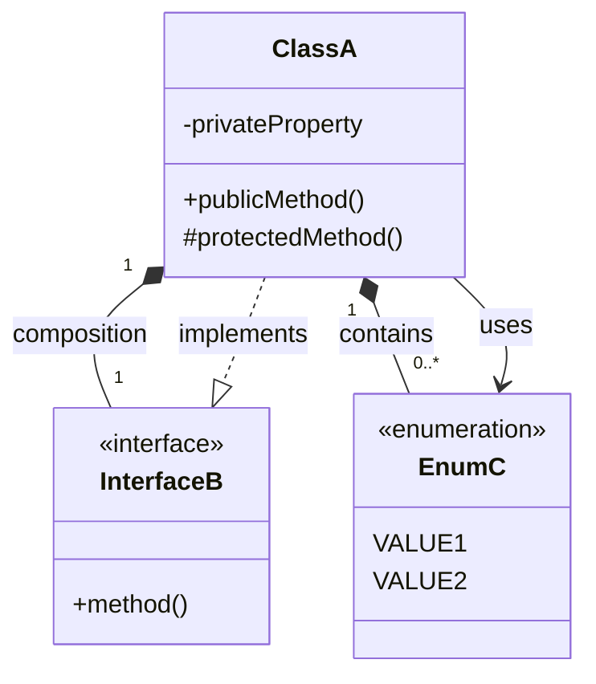

# クラス図ドキュメント

## 概要

このディレクトリには、accustomedプロジェクトの既存コードから抽出したクラス図が含まれています。

## ファイル構成

### [domain-models.md](./domain-models.md)

ドメインエンティティと値オブジェクト

- Task, TaskConfiguration, TaskInstance等の核となるビジネスオブジェクト
- TaskStatus, FrequencyUnit等の列挙型
- WeeklyData, MonthlyHistoryData等の履歴・統計関連の値オブジェクト

### [application-services.md](./application-services.md)

アプリケーション層のサービス

- useTasksフック：タスクのCRUD操作を提供
- TaskUtilityService：タスク操作のヘルパー関数群
- TaskStatsService：統計計算サービス
- TaskHistoryService：履歴データ整形サービス

### [infrastructure-services.md](./infrastructure-services.md)

インフラストラクチャ層のサービス

- LocalStorageRepository：データ永続化
- DateUtilityService：日付操作ユーティリティ
- TaskSerializationService：JSON シリアライゼーション
- エラーハンドリング戦略

### [presentation-layer.md](./presentation-layer.md)

プレゼンテーション層のコンポーネント

- Reactコンポーネントの階層構造
- Props インターフェース定義
- イベントハンドリングフロー
- useTasksフックとの連携

## アーキテクチャとの対応

| 設計書の層       | 実装状況                         | 対応ファイル               |
| ---------------- | -------------------------------- | -------------------------- |
| Domain層         | 型定義として実装                 | domain-models.md           |
| Application層    | Reactフック + ユーティリティ関数 | application-services.md    |
| Presentation層   | Reactコンポーネント              | presentation-layer.md      |
| Infrastructure層 | localStorage + ユーティリティ    | infrastructure-services.md |
| Shared層         | 一部は各層に分散                 | 各ファイルに分散           |

## 現在の実装と設計書の差異

### 1. 層の分離度

- **設計書**: 厳格な層分離（domain/, application/, presentation/, infrastructure/）
- **実装**: Next.js標準構造（types/, hooks/, components/, lib/）

### 2. ドメインモデル

- **設計書**: クラスベースのドメインエンティティ
- **実装**: TypeScriptインターフェースベースの型定義

### 3. ユースケース

- **設計書**: 個別のユースケースクラス（CreateTaskUseCase等）
- **実装**: useTasksフック内のメソッドとして実装

### 4. リポジトリパターン

- **設計書**: インターフェースと実装の分離
- **実装**: localStorage関数として直接実装

## 使用技術スタック

- **フレームワーク**: Next.js 13.5.1 + React 18.2.0
- **言語**: TypeScript
- **UI**: shadcn/ui + Tailwind CSS
- **データ永続化**: Browser localStorage
- **状態管理**: React Hooks (useState, useEffect)

## 図表記号の説明

### 関係性記号

- `*--` : コンポジション（強い所有関係）
- `..|>` : インターフェース実装
- `-->` : 依存関係

### 多重度記法

- `"1"` : 1つ
- `"0..*"` : 0個以上
- `"7"` : 固定7個
- `"28..42"` : 28から42個の範囲

## 更新履歴

- 2025-01-XX: 初版作成、既存コードからクラス図を抽出
