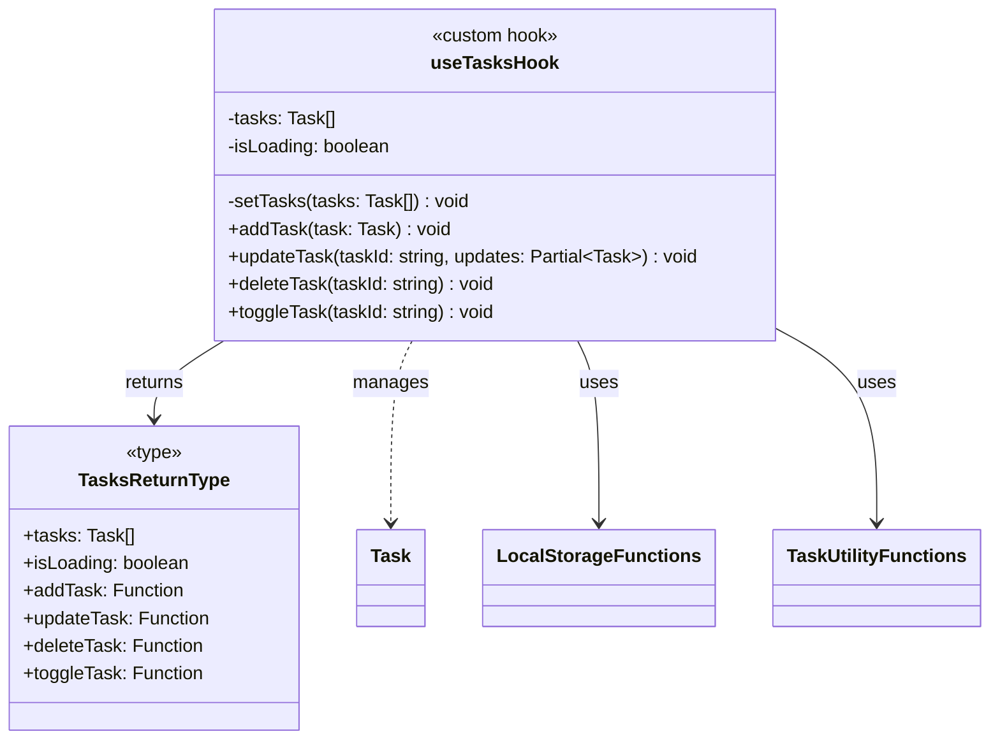
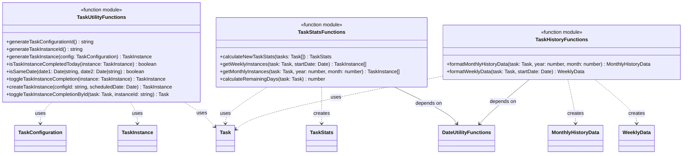
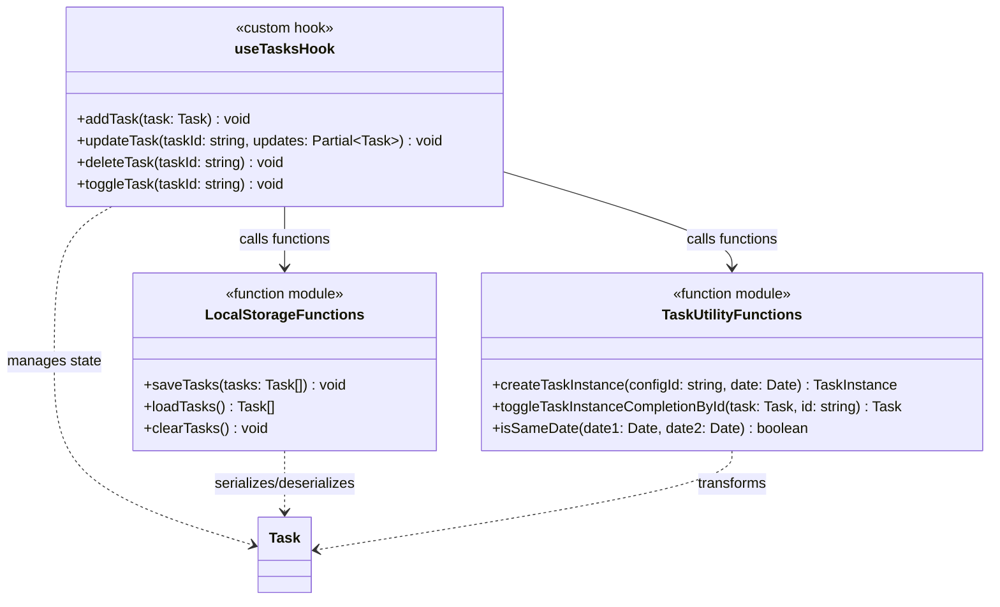

# アプリケーションサービス 関数構成図

## 概要

Reactフックとアプリケーションレイヤーの関数群を示す構成図です。
実装は関数型アプローチを採用しており、オブジェクト指向のクラスではなく個別の関数として構成されています。

## メインのReactカスタムフック

## タスクユーティリティ関数群

## 関数間の依存関係

## 実装ファイル対応表

| 関数群・フック        | 実装ファイル               | 主要関数                                                                      |
| --------------------- | -------------------------- | ----------------------------------------------------------------------------- |
| useTasksHook          | `/src/hooks/useTasks.ts`   | addTask, updateTask, deleteTask, toggleTask                                   |
| TaskUtilityFunctions  | `/src/lib/taskUtils.ts`    | generateTaskConfigurationId, createTaskInstance, toggleTaskInstanceCompletion |
| TaskStatsFunctions    | `/src/lib/taskUtils.ts`    | calculateNewTaskStats, getWeeklyInstances, getMonthlyInstances                |
| TaskHistoryFunctions  | `/src/lib/taskUtils.ts`    | formatMonthlyHistoryData, formatWeeklyData                                    |
| LocalStorageFunctions | `/src/lib/localStorage.ts` | saveTasks, loadTasks, clearTasks                                              |

## 使用パターン

### タスクの追加フロー

1. UIコンポーネントがuseTasks().addTask()を呼び出し
2. addTask関数がLocalStorageFunctions.saveTasks()でデータを永続化
3. ReactのuseStateでUIが更新される

### タスクの完了切り替えフロー

1. UIコンポーネントがuseTasks().toggleTask()を呼び出し
2. toggleTask関数がTaskUtilityFunctions.createTaskInstanceまたはtoggleTaskInstanceCompletionByIdを使用
3. 更新されたタスクをLocalStorageFunctions.saveTasks()で保存

## 設計上の特徴

- **関数型設計**: クラスベースではなく、個別の純粋関数として実装
- **カスタムフック**: useTasksでReactの状態管理とビジネスロジックを分離
- **モジュール化**: 機能別に関数をグループ化（Utils, Stats, History, Storage）
- **依存性注入**: 各関数は必要なデータのみを引数として受け取る
- **副作用の分離**: 状態変更はuseTasksフック内、純粋な変換処理はユーティリティ関数内
