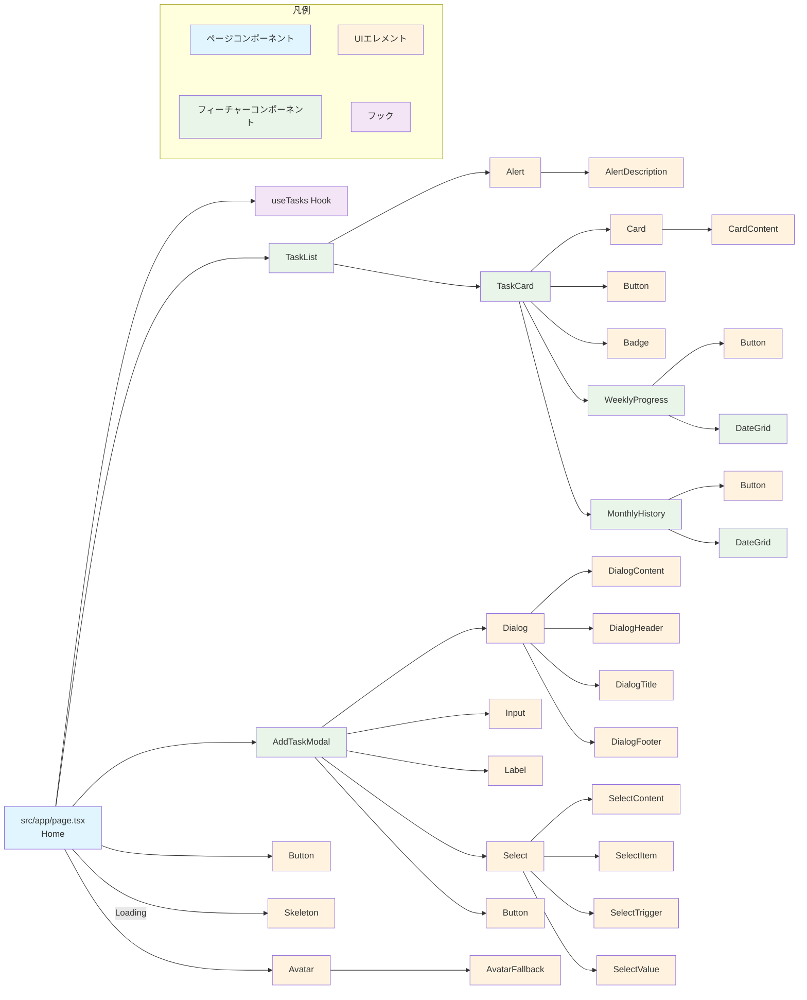

# コンポーネントツリー図

## 概要

App Router のページを起点としたプレゼンテーション層のコンポーネント呼び出し関係を示すツリー図です。

## メインページ (src/app/page.tsx)

```mermaid
graph LR

    Home[src/app/page.tsx<br/>Home] --> useTasks[useTasks Hook]
    Home --> TaskList[TaskList]
    Home --> AddTaskModal[AddTaskModal]
    Home --> Button[Button]
    Home --> | Loading | Skeleton[Skeleton]
    Home --> Avatar[Avatar]


    TaskList --> Alert[Alert]
    TaskList --> TaskCard[TaskCard]

    Alert --> AlertDescription[AlertDescription]

    TaskCard --> Card[Card]
    TaskCard --> Button2[Button]
    TaskCard --> Badge[Badge]
    TaskCard --> WeeklyProgress[WeeklyProgress]
    TaskCard --> MonthlyHistory[MonthlyHistory]

    Card --> CardContent[CardContent]

    WeeklyProgress --> Button3[Button]
    WeeklyProgress --> DateGrid[DateGrid]

    MonthlyHistory --> Button4[Button]
    MonthlyHistory --> DateGrid2[DateGrid]

    AddTaskModal --> Dialog[Dialog]
    AddTaskModal --> Input[Input]
    AddTaskModal --> Label[Label]
    AddTaskModal --> Select[Select]
    AddTaskModal --> Button5[Button]

    Dialog --> DialogContent[DialogContent]
    Dialog --> DialogHeader[DialogHeader]
    Dialog --> DialogTitle[DialogTitle]
    Dialog --> DialogFooter[DialogFooter]

    Select --> SelectContent[SelectContent]
    Select --> SelectItem[SelectItem]
    Select --> SelectTrigger[SelectTrigger]
    Select --> SelectValue[SelectValue]

    Avatar --> AvatarFallback[AvatarFallback]


    %% クラス定義（カラー適用）
    classDef page fill:#e1f5fe
    classDef feature fill:#e8f5e8
    classDef ui fill:#fff3e0
    classDef hook fill:#f3e5f5

    %% クラス適用
    class Home page
    class useTasks hook
    class TaskList,AddTaskModal,TaskCard,WeeklyProgress,MonthlyHistory,DateGrid,DateGrid2 feature
    class Button,Skeleton,Avatar,Alert,AlertDescription,Card,Button2,Badge,CardContent,Button3,Button4,Dialog,Input,Label,Select,Button5,DialogContent,DialogHeader,DialogTitle,DialogFooter,SelectContent,SelectItem,SelectTrigger,SelectValue,AvatarFallback ui

    %% 以下、凡例の定義
    %% 凡例アンカー（非表示ノード）
    TopLeft:::invisible
    classDef invisible fill:transparent,stroke:transparent,color:transparent;

    %% 凡例定義
    subgraph Legend ["凡例"]
        L1[ページコンポーネント]:::page
        L2[フィーチャーコンポーネント]:::feature
        L3[UIエレメント]:::ui
        L4[フック]:::hook
    end

    %% アンカーと凡例を1本だけつなぐ（この1本を透明にする）
    TopLeft ~~~ Legend

    %% 凡例の配置調整（凡例ノード同士のリンクを非表示にする）
    L1 ~~~ L2
    L3 ~~~ L4

```
