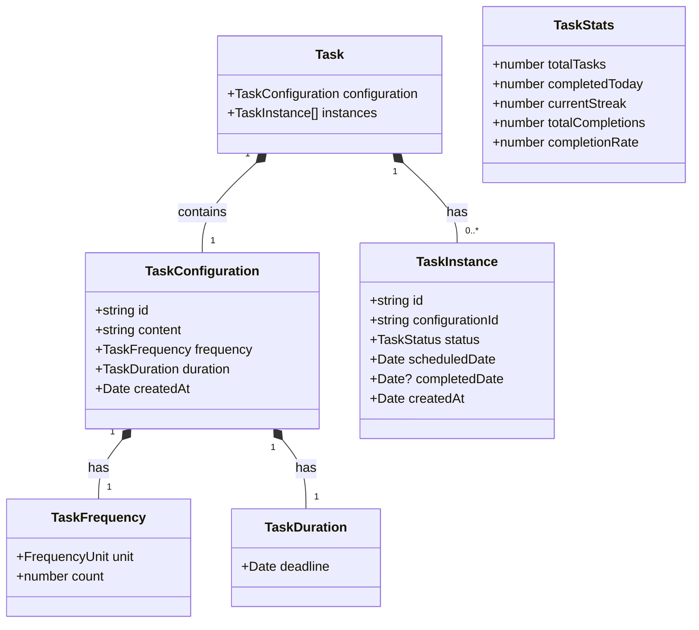
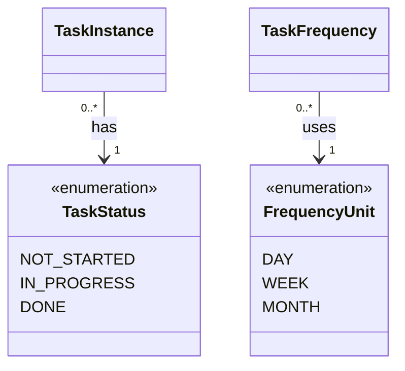
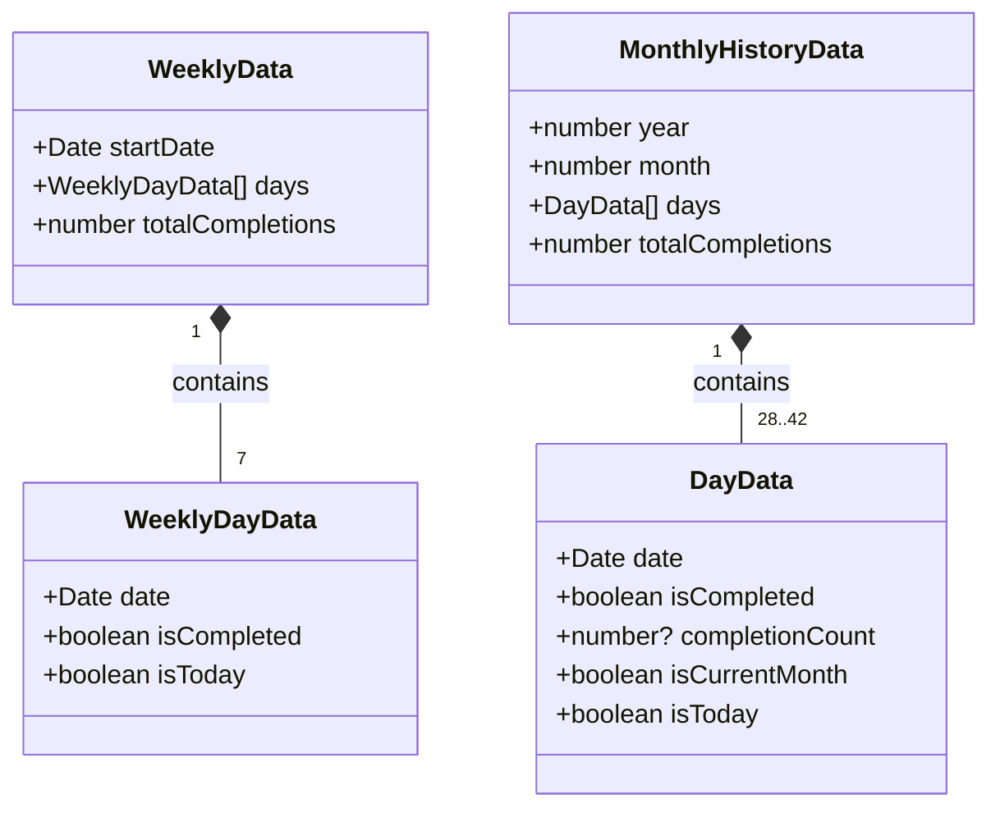

# ドメインモデル クラス図

## 概要

タスク管理アプリケーションの中核となるドメインエンティティと値オブジェクトの関係を示すクラス図です。

## ドメインエンティティとその関係

## 列挙型とその値

## 履歴・統計関連の値オブジェクト

## 設計上の注意点

- **Task**は集約ルートとして、TaskConfiguration と TaskInstance[]を管理
- **TaskInstance**は特定の日付に対するタスクの実行状況を表現
- **TaskConfiguration**はタスクの設定情報を不変オブジェクトとして管理
- 値オブジェクトは不変性を保ち、ビジネスルールを内包
