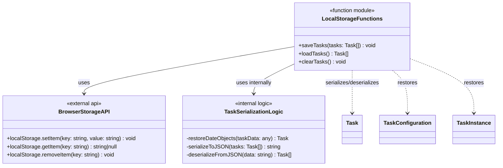
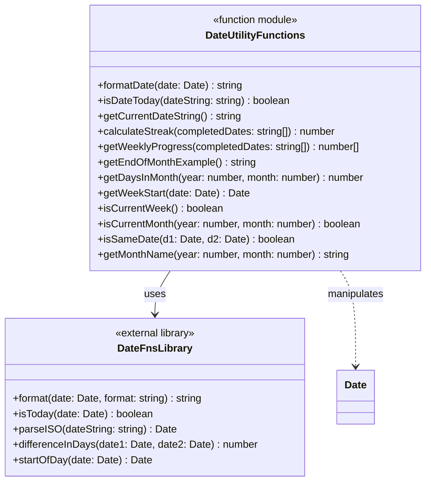
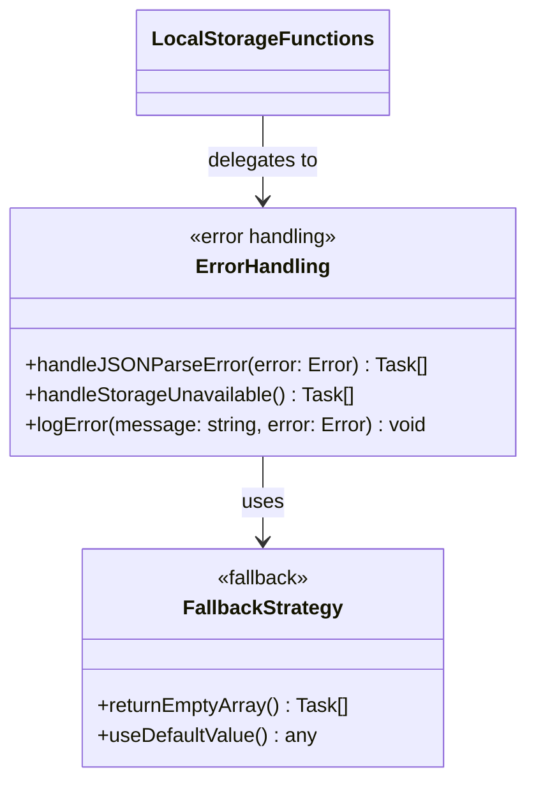
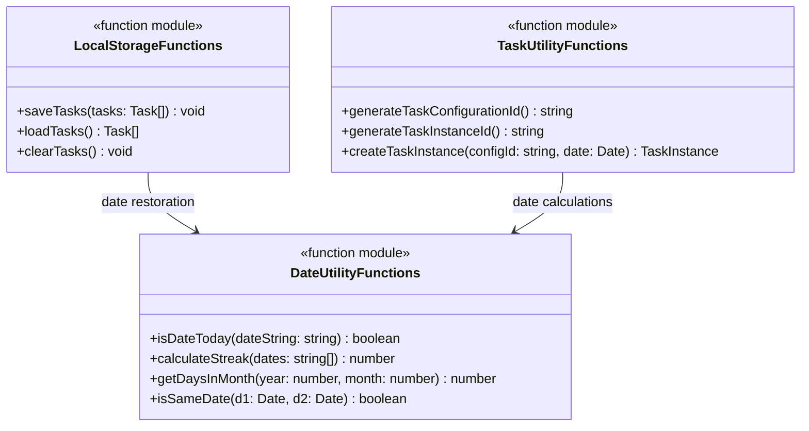

# インフラストラクチャサービス 関数構成図

## 概要

データ永続化とインフラストラクチャ関連の関数群を示す構成図です。
実装は関数ベースであり、クラス設計ではなく個別の関数として構成されています。

## データ永続化関数群



## 日付ユーティリティ関数群



## エラーハンドリング戦略



## インフラストラクチャ関数群の相互関係



## データシリアライゼーション詳細

```mermaid
flowchart TD
    A[Task Objects] --> B[JSON.stringify]
    B --> C[localStorage.setItem]

    D[localStorage.getItem] --> E[JSON.parse]
    E --> F[Date Object Restoration]
    F --> G[Restored Task Objects]

    subgraph "Serialization Process"
        A
        B
        C
    end

    subgraph "Deserialization Process"
        D
        E
        F
        G
    end

    subgraph "Date Field Restoration"
        F1[configuration.createdAt]
        F2[configuration.duration.deadline]
        F3[configuration.duration.startedAt]
        F4[instances[].scheduledDate]
        F5[instances[].completedDate]
        F6[instances[].createdAt]

        F --> F1
        F --> F2
        F --> F3
        F --> F4
        F --> F5
        F --> F6
    end
```

## 実装ファイル対応表

| 関数群                | 実装ファイル               | 主要関数                                            | 行数  |
| --------------------- | -------------------------- | --------------------------------------------------- | ----- |
| LocalStorageFunctions | `/src/lib/localStorage.ts` | saveTasks, loadTasks, clearTasks                    | 1-62  |
| DateUtilityFunctions  | `/src/lib/dateUtils.ts`    | formatDate, isDateToday, calculateStreak, etc       | 1-180 |
| TaskUtilityFunctions  | `/src/lib/taskUtils.ts`    | generateTaskConfigurationId, generateTaskInstanceId | 17-29 |

## 設計上の注意点

### ブラウザ環境の考慮

- **SSR対応**: `typeof window !== "undefined"` チェックでサーバーサイドレンダリングに対応
- **localStorage可用性**: ブラウザ環境でのみlocalStorageを使用

### データ整合性の保証

- **Date復元処理**: JSONシリアライゼーション時にDateオブジェクトが文字列になるため、復元時に明示的にDateオブジェクトに変換
- **エラーハンドリング**: 不正なデータが保存されていてもアプリケーションが停止しないよう、フォールバック値（空配列）を提供

### パフォーマンス考慮

- **同期処理**: localStorageは同期APIのため、大量データでのブロッキングに注意
- **メモリ効率**: 不要なオブジェクトコピーを避けたDate復元処理
