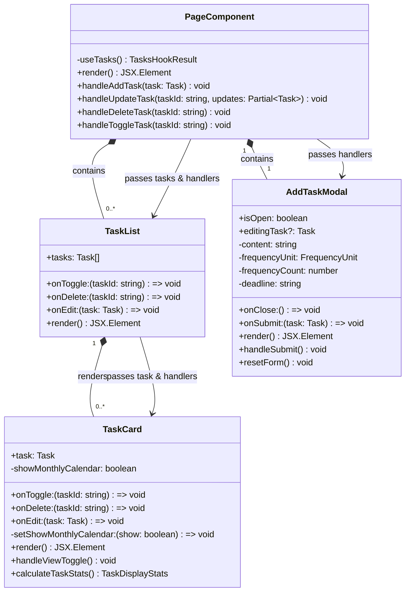
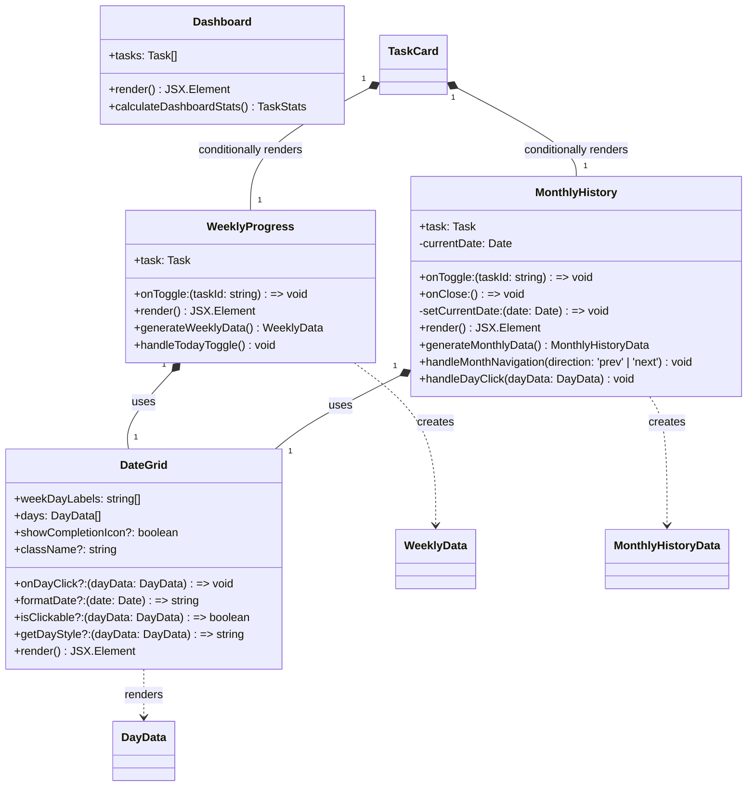
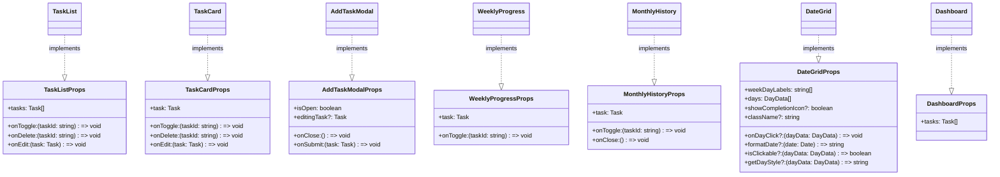
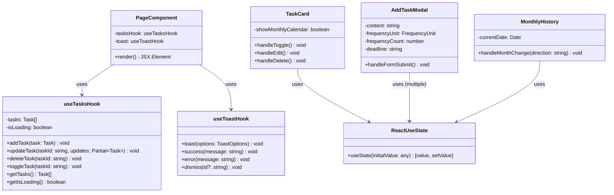
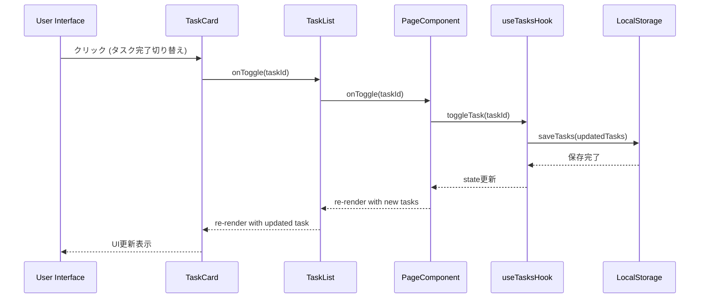

# プレゼンテーション層 クラス図

## 概要

React コンポーネントとプレゼンテーション層の構造を示すクラス図です。

## メインコンポーネント階層

## 表示・履歴コンポーネント

## Props インターフェース

## React フックとの連携

## イベントハンドリングフロー

## 実装ファイル対応表

| コンポーネント | 実装ファイル                          | 主要機能                     | 状態管理               |
| -------------- | ------------------------------------- | ---------------------------- | ---------------------- |
| PageComponent  | `/src/app/page.tsx`                   | アプリのルートコンポーネント | useTasks フック        |
| TaskList       | `/src/components/task-list.tsx`       | タスクリスト表示             | なし（props only）     |
| TaskCard       | `/src/components/task-card.tsx`       | 個別タスク表示・操作         | showMonthlyCalendar    |
| AddTaskModal   | `/src/components/add-task-modal.tsx`  | タスク追加・編集フォーム     | フォーム状態           |
| WeeklyProgress | `/src/components/weekly-progress.tsx` | 週間進捗表示                 | なし（props only）     |
| MonthlyHistory | `/src/components/monthly-history.tsx` | 月間履歴表示                 | currentDate            |
| DateGrid       | `/src/components/date-grid.tsx`       | 汎用日付グリッド             | なし（pure component） |
| Dashboard      | `/src/components/dashboard.tsx`       | 統計ダッシュボード           | なし（未使用）         |

## 設計上の特徴

- **単一責任の原則**: 各コンポーネントは明確な役割を持つ
- **Props による依存性注入**: イベントハンドラーは props として注入
- **状態の上昇**: 共有状態は useTasks フックで一元管理
- **コンポーネントの再利用性**: DateGrid は週間・月間表示で共用
- **条件付きレンダリング**: TaskCard 内で WeeklyProgress/MonthlyHistory を切り替え
